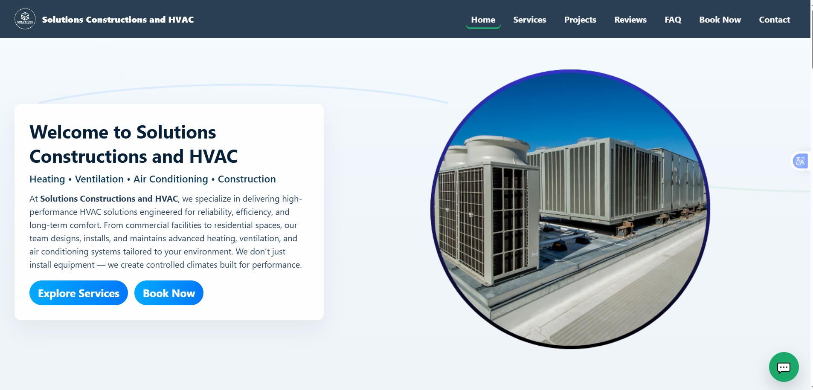
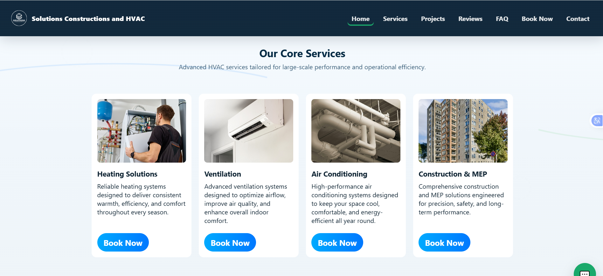
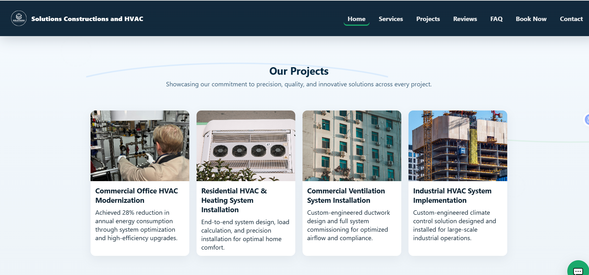
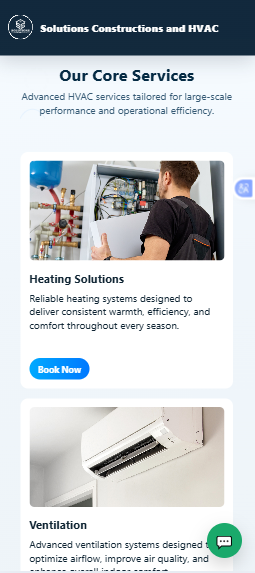

# Solutions Business Website

## Overview

Solutions is a professional business website developed to help companies establish a strong online presence. The website focuses on presenting services, building credibility, generating leads, and improving customer engagement through a modern and responsive design.

## Preview

A business-focused website featuring service sections, company information, contact forms, and professional branding elements.

## 📸 Screenshots

| Homepage                      | Services                      |
| ----------------------------- | ----------------------------- |
|  |  |

| Projects                      | Book Now                        |
| ----------------------------- | ------------------------------- |
|  |  |

| Contact Form                        | Testimonials & FAQs                            |
| ----------------------------------- | ---------------------------------------------- |
|  |  |

| Mobile Responsiveness               |
| ----------------------------------- |
|  |

## Features

* Professional business design
* Service showcase sections
* About company section
* Contact and inquiry forms
* Responsive layout
* Modern UI/UX
* Lead generation-focused structure

## Technologies Used

* HTML5
* CSS3
* JavaScript

## Live Demo

https://solutions-5jec.vercel.app/

## GitHub Repository
https://github.com/fizzajabeen13/Solutions-Business-Website

## Author

**Fizza Jabeen**
AI & Full Stack Developer
